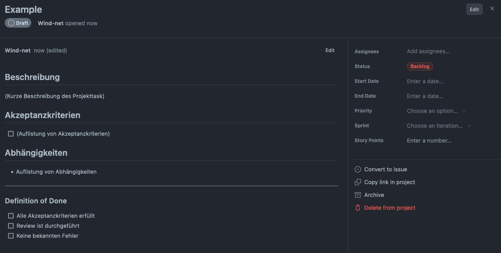

# 2.6 Tools & Software

Diese Semesterarbeit wird mit verschieden Tools unterstützt und ergänzt.

## 2.6.1 GitHub Projects
Die Tickets und das Zeitmanagement wird umgesetzt mit Hilfe von [GitHub Projects](https://docs.github.com/en/issues/planning-and-tracking-with-projects/learning-about-projects/about-projects). Da

### Sprint Board

Die Für die Projektarbeit wurde ein Scrum Board erstellt. Es wurden folgende Status festgelegt:

| **Backlog**                                                                      | **Todo**                                      | **in Progress**      | **Waiting**                   | **Done**      |
|----------------------------------------------------------------------------------|-----------------------------------------------|----------------------|-------------------------------|---------------|
| Diese Tickets befinden sich im Projektbacklog und sind nicht im aktuellen Sprint | Offene Task, welche im aktuellen Sprint sind. | Task in bearbeitung. | Task ist auf waiting gesetzt. | Task erledigt |

### Task Definitionen

Jedes Ticket hat folgende Werte gesetzt und definiert.

| **Wert**                                 | **Beschreibung**                                                                                      |
|------------------------------------------|-------------------------------------------------------------------------------------------------------|
| Assignees                                | Person, welche den Task umsetzt.                                                                      |
| Status                                   | Status - Draft, Backlog, Todo, In Progress, Waiting, Done                                             |
| Milestone                                | Epic Ticket. Somit können Grosse Arbeiten zusammengefasst und in kleinen Schritten abarbeitet werden. |
| Linked pull requests / Repository Branch | Verlinkung mit GIT-Branches                                                                           |
| Start Date                               | Datum - Start der Arbeiten                                                                            |
| End Date                                 | Datum - Ende der Arbeiten                                                                             |
| Priority                                 | Priorität der Arbeit - Low, Normal, High                                                              |
| Sprint                                   | Verlinkung mit dem Sprint in welchen die Arbeit gemacht wird.                                         |
| Story Points                             | Schätzung des Aufwand (Komplexität & Zeitaufwand)                                                     |

  
Beispiel eines Tickets

  

  Damit die Tickets immer den gleichen Aufbau haben wurde ein Template erstellt und eingerichtet.

## 2.6.2 GitHub Repository

Diese Arbeit wird in Markdown geschrieben. Die Files davon werden in einem Git-Repository in GitHub abgelegt.

## 2.6.3 GitHub Actions

[GitHub Actions](https://github.com/features/actions) ist eine CI/CD Lösung von GitHub. Diese ermöglicht dass für die Arbeit eine Pipeline eingesetzt werden kann um die Arbeit zu publizieren.

## 2.6.4 GitHub Pages

[GitHub Pages](https://pages.github.com/) ermöglicht, dass diese Arbeit als Website angeschaut werden kann. Zusammengefasst ist es ein einfaches Webhosting für statischen Inhalt.

## 2.6.5 Jekll

Mit Hilfe von [Jekll](https://jekyllrb.com/) werden die Markdown Files in html umgewandelt und ein Theme hinzugefügt. Somit für das ganze UI der Website wurde mit Jekll gemacht.
