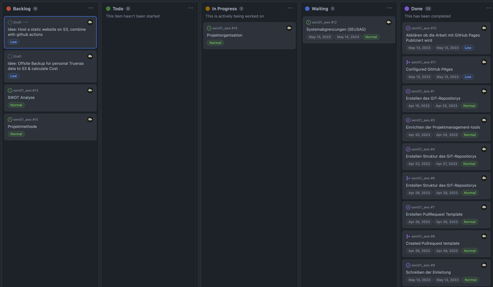

# 2.7.3 Sprint Review

## Review Sprint Ziele

| **Sprint Ziel**                                         | **Status** |
| ------------------------------------------------------- | ---------- |
| Projektstart                                            | 100%       |
| Erstellen der Grundstruktur des Repositorys             | 100%       |
| Erstellen von Task & PullRequest Vorlagen               | 100%       |
| Meilenstein Fertigstellung der Vorarbeiten abschliessen | 100%       |
| Dokumentation Projektmanagement erstellen               | 90%        |
| Tickets erstellen für die Projektarbeit                 | 100%       |
| Einrichten von GitHub Actions / Projects / Pages        | 100%       |

## Status Project Board

| **Total Tickets** | **Abgeschlossene Tickets** | **Nicht abgeschlossene Tickets** | **Prozentsatz** |
| :---------------: | -------------------------- | -------------------------------- | --------------- |
|        15         | 13                         | 2                                | 13.33%          |

## Anpassungen am Projekt?

Es werden keine Anpassungen am Projekt vorgenommen.

## Notizen / Anmerkungen

Der Start der Semesterarbeit gelang ohne grosse Hürden. Es wurden sehr viele administrative Arbeiten erledigt, welche leider sehr viel Zeit beansprucht haben. Für das Projekt sind sie jedoch notwendig. Ich denke, es sinnvoll ist diese Arbeiten zu Beginn durchzuführen, damit keine Konflikte entstehen.

Zu den zwei offenen Tickets. Leider konnten die Tickets mit der Nummer [#14](https://github.com/Cloud-native-engineering/sem01_aws/issues/14) und [#12](https://github.com/Cloud-native-engineering/sem01_aws/issues/12) noch nicht abgeschlossen werden. Dies wird im Projekt nicht kritisch betrachtet, weil beide Tickets schon zum grössten Teil erledigt sind. Beim dem einen Ticket wurde eine Meinung vom Business Owner angefragt, wobei die Antwort noch ausstehend ist. Deswegen konnte der Task noch nicht erledigt werden. Das andere Ticket konnte aus zeitlichen Gründen noch nicht abgeschlossen werden.

---

- [Alle Sprint Tickets](https://github.com/orgs/Cloud-native-engineering/projects/3/views/1?filterQuery=sprint%3A%22Sprint+1%22)
- [GIT Repository Tag - Sprint01](https://github.com/Cloud-native-engineering/sem01_aws/releases/tag/sprint-01)
