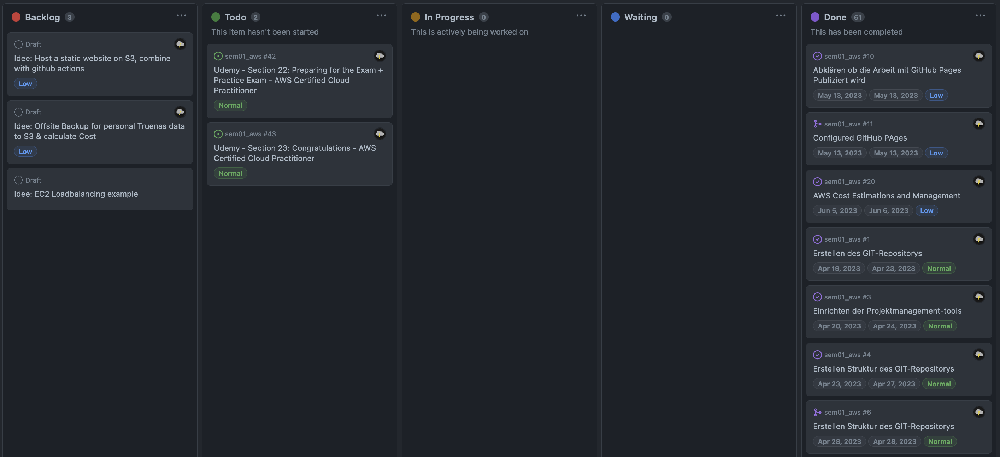

# 2.8.3 Sprint Review

## Review Sprint Ziele

| **Sprint Ziel**                | **Status** |
| ------------------------------ | ---------- |
| Durcharbeiten des Udemy Kurses | 91%        |
| Dokumentation der AWS Cloud    | 100%       |
| AWS Academy Kurs abschliessen  | 100%       |
| Beginn mit Hands-on-Projekte   | 0%         |

## Status Project Board

| **Total Tickets** | **Abgeschlossene Tickets** | **Nicht abgeschlossene Tickets** | **Prozentsatz** |
| :---------------: | -------------------------- | -------------------------------- | --------------- |
|        40         | 38                         | 2                                | 95%             |

## Anpassungen am Projekt?

Der Aufwand der Kursinhalte wurde unterschätzt. Es wurde entschieden, dass das Sprint Ziel "Beginn mit Hands-on-Projekte" in den nächsten Sprint verschoben wird.

## Notizen / Anmerkungen

Dieser Sprint widmete sich ganz  dem persönlichen Lernprozess. Dazu wurden verschiedene Kurse absolviert. Es wurde der AWS Academy und der Udemy Kurs durchgeführt. Beide Kurse hatten eine sehr gute Qualität und waren hilfreich.

Folgende zwei Tasks konnten noch nicht abgeschlossen werden:

- [#42](https://github.com/Cloud-native-engineering/sem01_aws/issues/42)
- [#43](https://github.com/Cloud-native-engineering/sem01_aws/issues/43)

Der Grund dafür ist, dass diese Tasks zeitlich noch nicht ganz bearbeitet werden konnten, da der Zeitaufwand für die Kurse überschätzt wurde.

---

- [Alle Sprint Tickets](https://github.com/orgs/Cloud-native-engineering/projects/3/views/1?filterQuery=sprint%3A%22Sprint+2%22)
- [GIT Repository Tag - Sprint02](https://github.com/Cloud-native-engineering/sem01_aws/releases/tag/sprint-02)
