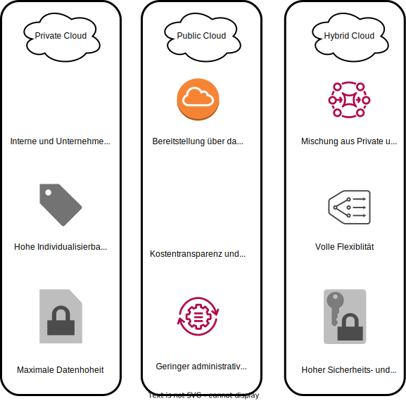

# 3.1 Was ist eine Cloud?

Das englische Wort "cloud", auf deutsch Wolke bezieht sich auf die IT-Infrastruktur. Diese Infrastruktur (Rechenzentrum, Server, Storage, etc) kann über verschiedene Wege bezogen werden.

## 3.1.1 Arten von Clouds

### Private Cloud

Bei einer Privaten Cloud wird das ganze Rechenzentrum on-site von der Firma betrieben. Dazu müssen eine Räumlichkeit gemietet, gewartet und betrieben werden. Es entstehen dabei eine Unzahl an Kosten wie zum Beispiel:

- Kauf/Miete der Räume
- Stromrechnung
- Internetanschluss
- Kühlung der Räume
- Anschaffungskosten der Hardware
- Lifecycle management der Hardware
- usw...

### Public Cloud

Bei einer Public Cloud werden die Rechenleistungen bei einem externen Anbieter über das Internet bezogen. Dieser Service bieten viele grosse Hyperscaler, wie zum Beispiel [Microsoft Azure](https://azure.microsoft.com), [Google Cloud Platform](https://cloud.google.com), [Amazon AWS](https://aws.amazon.com) und viele weitere Anbieter an. Die Public Cloud bietet als Vorteil, dass nur Kostenentstehen, was man gebraucht hat. Ein Beispiel wäre, man hat einen Server 30 Stunden betrieben, so müssen nur die 30 Stunden bezahlt werden und nicht den ganzen Monat, oder die Anschaffung eines Servers. Die Economics of Scale ermöglicht, dass viele Kosten unter den verschiedenen Kunden aufgeteilt werden können. Das heisst, je mehr Kunden die Cloud hat, desto günstiger werden die Kosten.

### Hybrid Cloud

Eine Hybrid Cloud ist eine Mischung von einer Private- und Public Cloud. Es können beide optimal eingesetzt werden und die Firma ist flexibel, wo sie Ihre Services betreiben will.

## 3.1.2 CapEx vs. OpEx vs. TCO

CapEx, OpEx und TCO sind Begriffe, welche oft im Zusammenhang mit der Cloud verwendet werden. Diese Begriffe werden verwendet um Kosten der Cloud Modelle zu beschreiben.

### CapEx - Capital Expenditure

Unter CapEX, auch "capital expenditure" wird das Investment in die physische Vermögenswerte zusammengefasst. Diese Anschaffungen werden über mehrere Jahre abgeschrieben und müssen im voraus Angeschafft werden.

- Hardware
- Ersatzteile
- Gebäude
- Klimageräte

### OpEx - Operational Expenditure

Unter OpEX, auch "operational expenditure" werden die wiederkehrende Kosten, welche beim Betrieb von Assets entstehen zusammengefasst. Diese werden monats-, quartals-, oder per jahres-weise verrechnet.

- Cloud Server
- Strom
- Internetleitung
- Software
- Hardware miete

### TCO - Total Cost of Ownership

Unter TCO, "total cost of ownership" wird zusammengefasst was die gesamtkosten eines Gerätes sind. Zum Beispiel umfasst die TCO alle Kosten, welche im zusammenhang mit eines Services stehen. Bei einem [WordPress](https://wordpress.com) Blog wären das folgende:

- Stromrechnung der Server (Webserver & Datenbank)
- Anteil der Internetanschlusses
- Hardware Anschaffungskosten & Lifecycle

Viele Cloud Anbieter bieten Kostenrechner an, mit welchem die Gesamtkosten eines IT-Services berechnet und verglichen werden kann.

## 3.1.3 Arten von Public Cloud Services

Cloud Dienstleistungen können über verschiedene Arten betrieben werden. Unter folgendem Abschnitt werden die "as as Service" Modelle beschrieben und erklärt.

### IaaS - Infrastructure as a Service

Infrastructure as a Service kann am einfachsten mit einem traditionellen (nicht virtualisierten) Rechenzentrum verglichen werden.

Die Verantwortung für das Betriebssystem, Daten, Backup und die Anwendung ist der **Nutzer** verantwortlich.

### PaaS - Platform as a Service

Als Platform as a Service versteht man, wenn die Verantwortung des Betriebssystem nicht mehr beim Nutzer ist. Der Nutzer muss sich somit nicht um das Betriebssystem und updates und das Netzwerk kümmern.

Der Nutzer schreibt und verwaltet sein Code und deployed den code als Apps. Er muss keine Software-Updates oder Hardwarewartung machen. Für den Aufbau der Infrastruktur ist der Anbieter verantwortlich.

### SaaS - Software as a Service

Bei einem Software as a service ist die meiste Verantwortung ausgelagert und nicht beim Nutzer. Der Nutzer verwaltet nur seine Daten in dieser Plattform.

Einige Beispiele für SaaS-Lösungen: [Dropbox](https://dropbox.com), [Gmail](https://mail.google.com), [Slack](https://slack.com)
