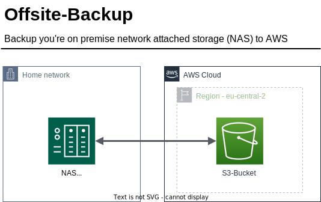
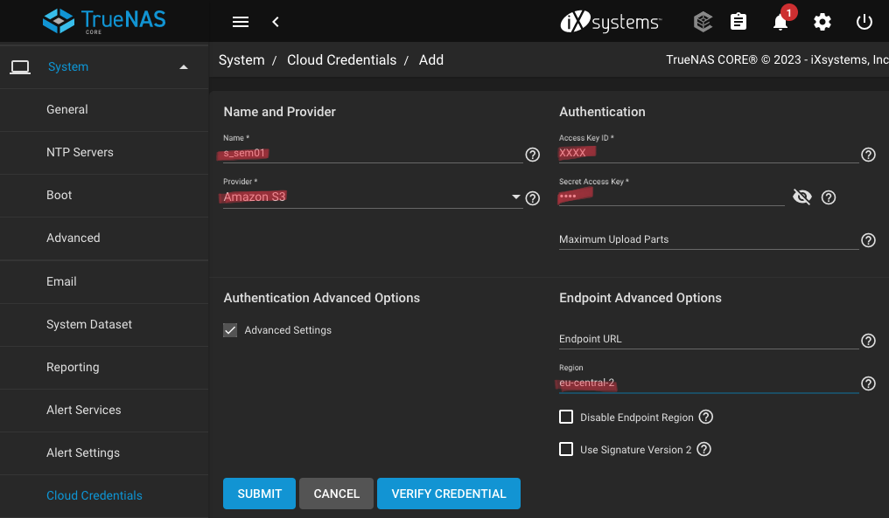
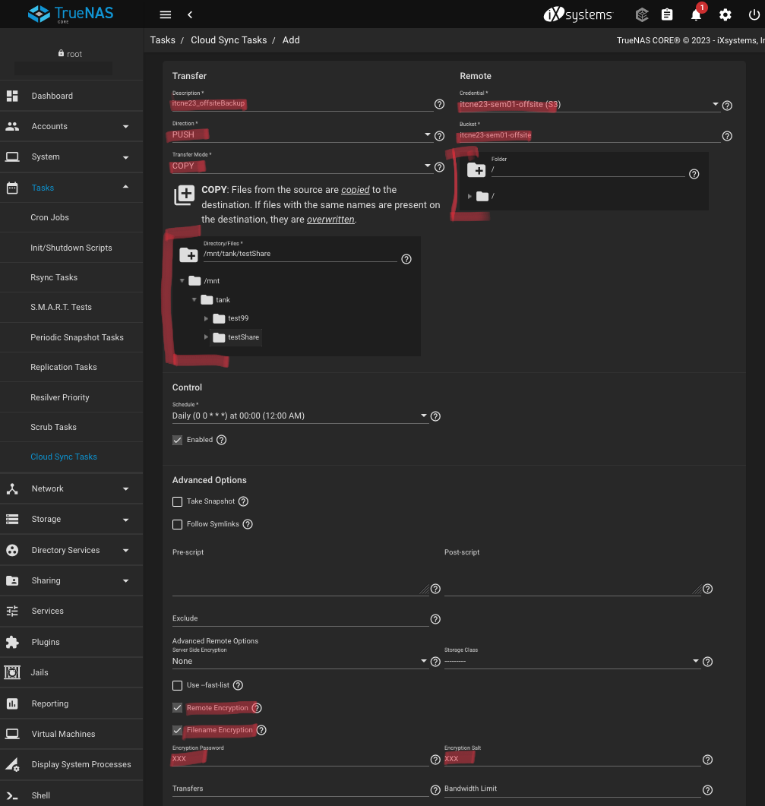

# 5.1 Offsite Backup

Ein richtiges Backupkonzept umfasst eine Sicherung an einem externen (weiteren) Standort. Dies wird auch Offsite Backup genannt. In diesem Projekt soll der externe Partner für das Offsite Backup ein S3 Bucket von Amazon AWS sein. Es soll ermittelt werden, ob dieses Projekt wirtschaftlich für eine Private Person ist, welche sein privates NAS absichern will.

Folgende Punkte sind Mass entscheidend für dieses Projekt:

- Verschlüsselung der Daten
- Verfügbarkeit
- Kosten (Wirtschaftlichkeit)



## 5.1.1 AWS Services

In diesem Projekt wird hauptsächlich der S3 Service von AWS angesprochen. Grundsätzlich könnte auch eine VPN eingesetzt werden. Auf eine VPN wird aber verzichtet, da die Kommunikation bereits über TLS/SSL verschlüsselt ist.

### Speicherklasse

Für den "Proof of Concept" (PoC) wird ein normaler S3 Service benutzt. Dies wurde so gewählt, damit ein Restore schnell und kostengünstig getestet werden kann.

Für einen **produktiven** Einsatz sollte aber die S3 Glacier Produktpalette von AWS gewählt werden, da diese für langzeit Backups kostengünstiger sind. Es muss aber beachtet werden, dass der Zugriff um die Daten herunterzuladen länger dauern kann. Dies ist aber bei einem Offsite Backup nicht sehr wichtig, da dies meistens nur als Notfallwiederherstellung gebraucht werden und nicht regelmässig. Bei einem S3 Produkt von Glacier werden die Daten verschlüsselt. Die Verschlüsselungsschlüssel werden dabei von AWS verwaltet. Der Kunde kann aber zusätzlich bevor er die Daten in den S3 lädt bei sich verschlüsseln. Somit hat AWS nie zugriff auf die Unverschlüsselten Daten

## 5.1.2 Kostenanalyse

Die Kosten für ein Solches Projekt sind nicht zu unterschätzen. Wenn dieses Projekt in einem privaten Umfeld betrieben wird, dürfen keine grossen Kosten entstehen.

Um ein die Kosten besser einschätzen zu können wurde der [AWS Pricing Calculator verwendet](https://calculator.aws). Dabei gelten folgende Grundsätze, welche die Kosten beeinflussen.

- Netzwerk
  - IN-Bound - Der Traffic in die AWS Cloud ist gratis.
  - OUT-Bound - Der Traffic hinaus der AWS Cloud wird verrechnet. In diesem Projekt würden diese Kosten nur bei einem Restore entstehen
- Speicher
  - Gebrauchter Speicher
  - Anzahl zugriffe (read/write)

### Fallbeispiel

In diesem Beispiel sollen 2'000 GB Daten in AWS als offsite Backup gespeichert werden. Ein Restore wird in diesem Beispiel nicht eingerechnet.

|        **Speicherklasse**       | **Monatliche Kosten** |
|:-------------------------------:|:---------------------:|
| S3 Standard storage             |             55.19 USD |
| S3 Standard - Infrequent Access |             30.41 USD |
| S3 One Zone - Infrequent Access |             24.33 USD |
| S3 Glacier Flexible Retrieval   |              9.17 USD |
| S3 Glacier Deep Archive         |              4.09 USD |

Berechnungen: [2023_Costs_AWS_offsiteBackup.pdf](../../ressources/artifacts/2023_cost_offsite_backup.pdf)

Wenn man diese Berechnung anschaut ist es sehr gut ersichtlich, dass dieses Projekt auch für Privatpersonen sehr Wirtschaftlich ist. Die Kosten können optimiert werden, wenn die richtige Speicherklasse verwendet wird.

Im Falle eines Restores in einer kostengünstigen Glacier Speicherklasse können erhöhte Kosten entstehen. Für einen standard restore von 2000 GB Daten muss mit ~40.00 CHF gerechnet werden.

> Für 5 Schweizer Franken können 2000 GB Daten in einem S3 Glacier Deep Archive gespeichert werden!

## 5.1.3 Umsetzung

Dieses Projekt wurde umgesetzt mit Hilfe von Ansible. Die Infrastruktur und die Berechtigungen werden komplett mit Ansible aufgesetzt.
Ansible macht folgende Schritte:

1. IAM
    1. Erstellen eines IAM Benutzer für das NAS
    2. Hinzufügen einer Policy, welche ermöglicht auf den S3-Bucket zu schreiben.
2. S3-Bucket
    1. Erstellen eines S3-Buckets
    2. Berechtigungen und Policies setzen

### Deploy

Folgende Requirements müssen erfüllt sein, damit die Automatisierung funktioniert:

- AWS CLI (Installiert & Konfiguriert)
- [Ansible installiert](https://docs.ansible.com/ansible/latest/installation_guide/intro_installation.html)
- Ansible [AWS Collection](https://docs.ansible.com/ansible/latest/collections/amazon/aws) installiert

### Install

```bash
cd ressources/artifacts/s3_backup/

ansible-playbook create_bucket.yml
```

### Remove

```bash
cd ressources/artifacts/s3_backup/

ansible-playbook create_bucket.yml -e deploy_state=absent
```

Danach muss noch der Sync auf dem NAS eingerichtet werden. dazu sind folgende Schritte notwendig:

1. Hinzufügen der Cloud Credentials (System > Cloud Credentials)
  1. <details>
      <summary>screenshot</summary>
      
      </details>
2. Erstellen eines Cloud Sync Tasks (Tasks > Cloud Sync)
  1. <details>
      <summary>screenshot</summary>
      
      </details>

## 5.1.3 Fazit