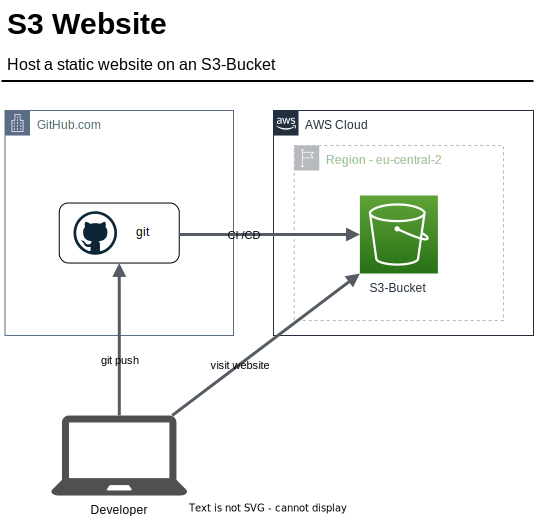

# 5.2 Host Website on S3

In diesem Projekt will ich meine Semesterarbeit neben dem Hosting auf GitHub Pages auch auf einem S3 publizieren. Das Publishing soll mit der CI/CD-Pipeline von GitHub Actions erfolgen.

Der S3 Service von Amazon AWS ermöglicht [statische Websiten zu hosten](https://docs.aws.amazon.com/AmazonS3/latest/userguide/WebsiteHosting.html). Dazu muss ein S3 Bucket erstellt werden und die HTML-Files hochgeladen werden. Auch müssen dazu noch die Berechtigungen richtig gesetzt werden.

## 5.2.1 Kostenanalyse

Es ist mit sehr kleinen Kosten zu rechnen. Wenn die HTML-Files und die Bilder kleiner als 5 GB Speicher sind, ist mit keinen Kosten zu rechen. Grund dafür ist das Amazon einen [Free Tier](https://aws.amazon.com/free) anbietet.

