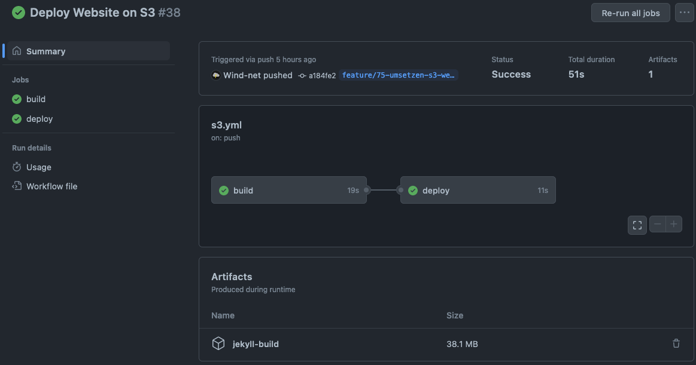

# 5.2 Host Website on S3

In diesem Projekt will ich meine Semesterarbeit neben dem Hosting auf GitHub Pages auch auf einem S3 publizieren. Das Publishing soll mit der CI/CD-Pipeline von GitHub Actions erfolgen.

Der S3 Service von Amazon AWS ermöglicht [statische Websiten zu hosten](https://docs.aws.amazon.com/AmazonS3/latest/userguide/WebsiteHosting.html). Dazu muss ein S3 Bucket erstellt werden und die HTML-Files hochgeladen werden. Auch müssen dazu noch die Berechtigungen richtig gesetzt werden.


## 5.2.1 Kostenanalyse

Es ist mit sehr kleinen Kosten zu rechnen. Wenn die HTML-Files und die Bilder kleiner als 5 GB Speicher sind, ist mit keinen Kosten zu rechen. Grund dafür ist das Amazon einen [Free Tier](https://aws.amazon.com/free) anbietet.

## 5.2.2 Umsetzung

In diesem Projekt wird zu allen Ressourcen ein Tag "project_Name" gesetzt. Damit ist besser ersichtlich, welche Ressourcen erstellt wurden.

1. IAM
   1. Erstellen eines IAM users für die CI/CD Pipeline
   2. generieren von access keys
   3. Erstellen einer IAM Policy. [iam-policy](../../ressources/artifacts/s3_website/s3_iam_policy_write.json)
   4. Hinzufügen der Policy am IAM user
2. S3 Bucket
   1. Erstellen eines S3 Bucket
   2. Deaktivieren vom "Public access block"
   3. Hinzufügen der bucket Policy. [s3-bucket-policy](../../ressources/artifacts/s3_website/s3_bucket_policy.json)
   4. Object Ownership auf Object writer setzen.
   5. Aktivieren von static Website
3. CI/CD Pipeline
   1. Erstellen eines GitHub Actions environment (name=jekyll, [config](../../ressources/images/2023_github_actions_secrets.png)
   2. Pipeline ins GitHub Repository setzen unter ".github/workflows/s3.yml". [workflow-example](../../ressources/artifacts/s3_website/s3.yml)
4. Nun wird bei einem Push auf das Repository die Pipeline ausgeführt und die Website auf den S3 publiziert.

```bash
# Create an S3 Bucket
aws s3api create-bucket \
  --bucket <BUCKET-NAME> \
  --region eu-central-2 \
  --create-bucket-configuration LocationConstraint=eu-central-2

# Disable "public-access-block"
aws s3api put-public-access-block \
  --bucket <BUCKET-NAME> \
  --public-access-block-configuration "BlockPublicAcls=false,IgnorePublicAcls=false,BlockPublicPolicy=false,RestrictPublicBuckets=false"

# Upload publicRead Policy
aws s3api put-bucket-policy \
  --bucket <BUCKET-NAME> \
  --policy file://<PATH-TO-JSON-FILE>

# Enable static website hosting
aws s3 website s3://<BUCKET-NAME>/ --index-document index.html --error-document error.html

# Create IAM Policy
aws iam create-policy \
  --policy-name s3_website_write \
  --policy-document file://<PATH-TO-JSON-FILE>

# Create user for CI/CD access
aws iam create-user \
  --user s_s3_website

# Attach policy to user
aws iam attach-user-policy \
  --policy-arn arn:aws:iam:<ACCOUNT-ID>:aws:policy/s3_website_write \
  --user-name s_s3_website
```

## 5.2.3 Testing

Nach diesem Deployment mittels CLI Kommandos kann nun diese Semesterarbeit in einem S3-Bucket gehostet werden. Der Inhalt der Website wird automatisch mit Hilfe einer CI/CD-Pipeline auf dem S3-Bucket publiziert. Der Zugriff mittels Webbrowser funktioniert und die Semesterarbeit wird richtig dargestellt. Die Berechtigungen sind richtig gesetzt, damit auf die Website zugegriffen werden kann.



## 5.2.4 Reflexion

Rückblickend muss ich sagen, dass alle Anforderungen an dieses Hands-on-Projekt erfüllt wurden. Die Website konnte erfolgreich mit Hilfe einer CI/CD Pipeline publiziert werden. Die Umsetzung konnte tadellos durchgeführt werden. Bei der Berechtigungen für den Bucket gab es einige Probleme, da diese noch zu sehr dem "least privilege" Prinzip definiert wurde. Aber nach dem korrekten Setzen dieser Berechtigungen konnte das Deployment auf den S3-Bucket ohne weiteren Probleme erfolgen.

### Mögliche Optimierungen

Wie bei jedem Projekt gibt es mögliche Punkte, welche optimiert werden könnten.

#### AWS Berechtigungen

In Hinsicht auf die Sicherheit würde die Verwendung von kurzlebigen Zugriffsschlüssel mehr Sinn ergeben. Access Keys (Access Key & Secret Access Key) sollte nicht verwendet werden, da diese langlebig sind. Es könnte somit passieren, wenn jemand schreibrechte zum GitHub Repository hat, dass er diese in den Output von der CI/CD Pipline ausgibt. Somit könnten den Zugriff auf den S3-Bucket komprimiert werden.

Es ist empfohlen, OpenID Connect zu verwenden. Mittels dieser Technology ist es möglich, dass die Pipeline nur kurzlebige Berechtigungen hat, um auf den S3-Bucket zu schreiben. Falls diese Keys komprimiert werden, währen diese unbrauchbar, da diese nicht mehr gültig sind.

In diesem Projekt wurde auf die Verwendung von OpenID Connect verzichtet, da die Access Keys mit Sorgfalt verwaltet werden und die Berechtigungen auf das Git Repository sehr fein geregelt sind.

[GitHub.com - Configuring OpenID Connect in Amazon Web Services](https://docs.github.com/en/actions/deployment/security-hardening-your-deployments/configuring-openid-connect-in-amazon-web-services)
